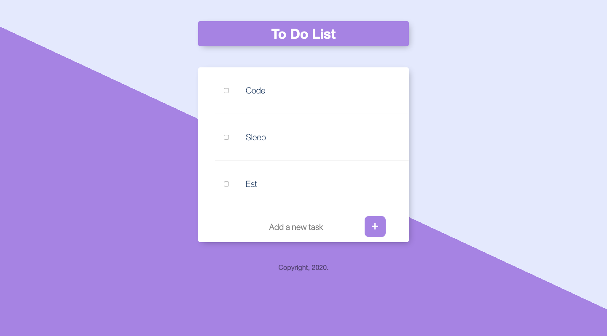
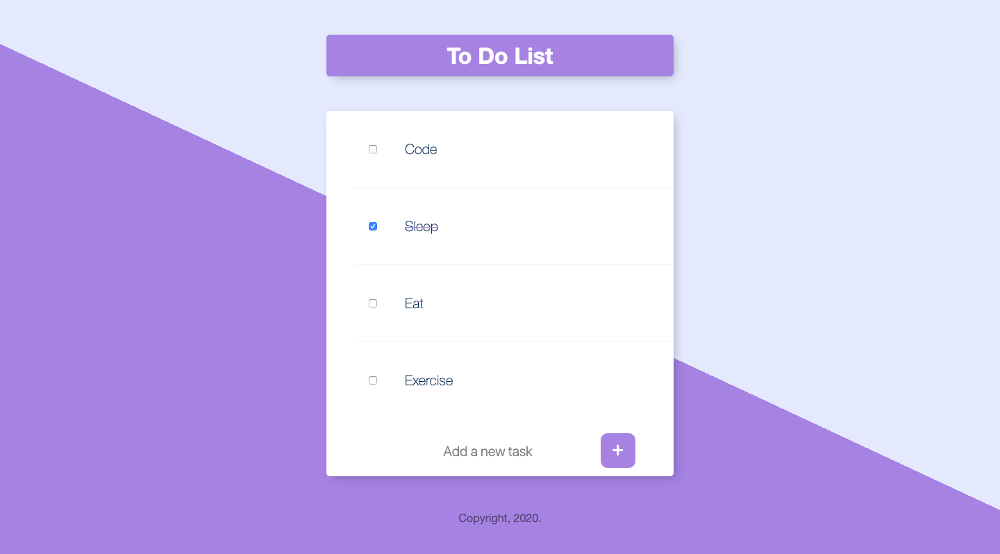
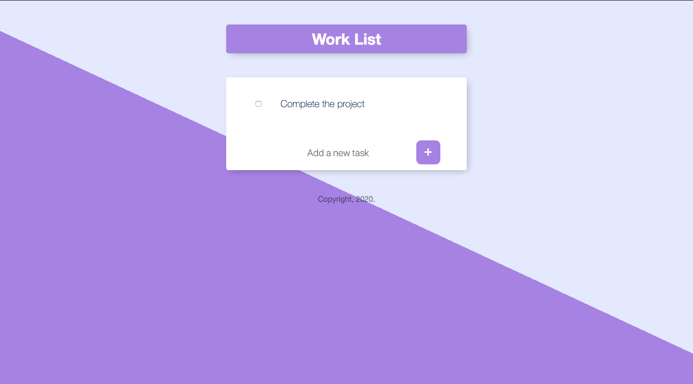

# To Do List Web App
This is a simple To Do List App with the features of adding, removing and storing tasks, and creating as many lists. 

## Requirements
- Node (version 14.0+)
- npm (version 6.0+)
- MongoDB
- A Web Browser
- Git

### Dependencies
This project relies heavily on the following ```npm``` packages:
- express
- body-parser
- mongoose
- ejs

## Download/Install
To run this project, clone the repository by either of the two methods:
- Go to Code → Download ZIP, and extract the ZIP file.
- Go to Terminal, and run the following command: <br>
```git clone https://github.com/abhinrustagi/ToDo-List.git```

Then,
- Run the following command: <br> ```node app.js```

**Make sure you have node installed on your system.**

**If in case the ```node_modules``` folder is not available in your downloaded directory, go to Terminal, navigate to the folder containing the project and run ```npm install```.**

### Setting up the database
Start a mongod process by running the following command in the terminal. A mongod process is usually started at 27017 port.

### Running the application
Make sure you have completed all the steps in the Initialization section. Navigate to the project directory, run the following command in Terminal, it should return some output.
```Connection established to the database.```
```Server started on port 8888.```

This means the application is up and running successfully. Now, to open the application, go to the browser and type the following address:
```localhost:8888/```

## Adding New Items
To add new items, type your task in the textbox at the bottom, and click the '+' button.

## Removing items
To remove an item, click the checkbox to the left of the item.

## Creating a new list
To create a new list, go to the address bar and type the following:

```localhost:8888/nameOfNewList```
      
where nameOfNewList is the name of the new list you wish to create. You can access this new list anytime, and your items won't be lost.

## Screenshots
**Home Screen**


**Adding a new item**


**New Item Added**


**New List** (```/work```)


## References
- [Node Documentation](https://nodejs.org/en/docs/)
- [Express Documentation](https://expressjs.com/)
- [EJS Documentation](https://ejs.co/#docs)
- [Body Parser Documentation](https://www.npmjs.com/package/body-parser)
